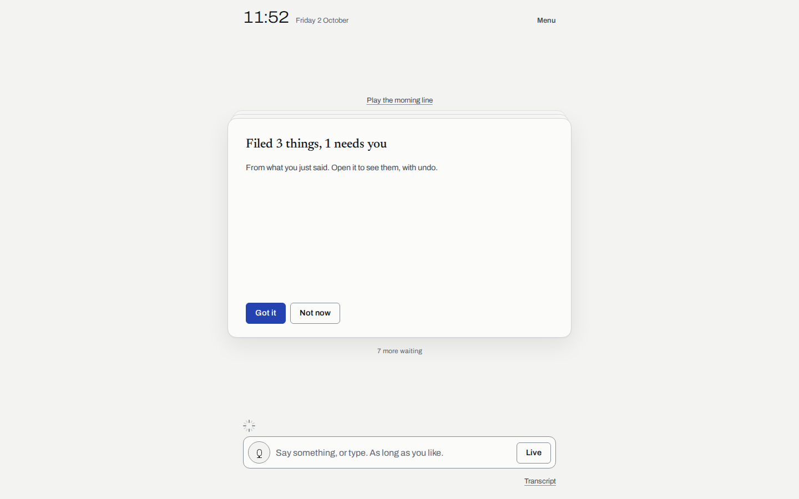
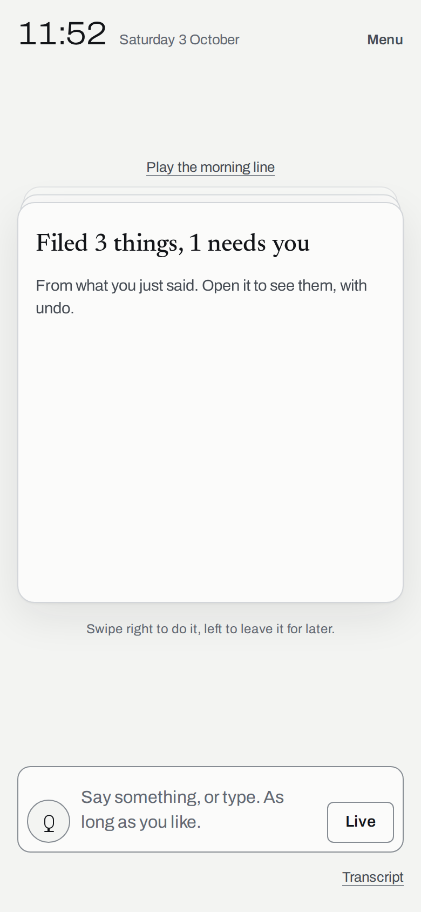
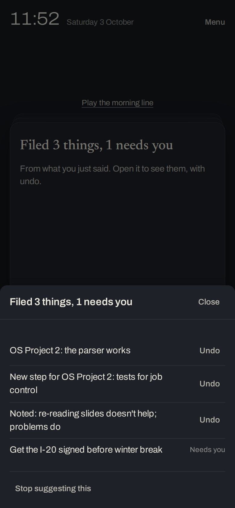
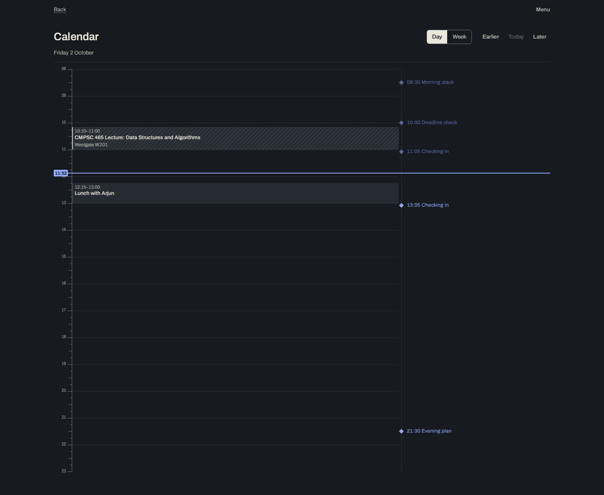

# Ava

A self-hosted, proactive personal agent for one person. Ava keeps a model of your commitments, deadlines, projects and rhythms, plans ahead, and reaches out only when a rule and real evidence say she should. You talk to her by voice or text; what needs you arrives as a short stack of cards — her judgment, one thing at a time — with the whole picture a tap deeper and the full database behind one menu.

The core principle: **the model plans, the system owns time.** Nothing runs continuously. A deterministic scheduler wakes Ava, deterministic rules decide whether there is a reason to reach out, a validator checks every message against stored state, and caps, quiet hours and budgets are enforced in code that nothing Ava writes can change.



| Phone, light | Phone, dark | Desktop, dark |
|---|---|---|
|  |  |  |

More in [docs/screenshots](docs/screenshots): every screen on phone and desktop, in both themes.

## Contents

- [Quick start](#quick-start)
- [Configuration](#configuration)
- [Connecting sources](#connecting-sources)
- [Voice](#voice)
- [Notifications and the installable app](#notifications-and-the-installable-app)
- [The laptop activity collector](#the-laptop-activity-collector)
- [Deploying](#deploying)
- [Developing](#developing)
- [Repository layout](#repository-layout)

Design and internals: [docs/architecture.md](docs/architecture.md) (how it works) and [docs/design-plan.md](docs/design-plan.md) (how it looks and why). What was built, verified and left open: [HANDOFF.md](HANDOFF.md).

## Quick start

Requirements: Node.js 22.13 or newer (Ava uses the built-in `node:sqlite`), npm 10.

```sh
git clone https://github.com/cybercryptixcoder/Ava.git && cd Ava
npm install
cp .env.example .env          # optional for a first look; see Configuration
npm run dev:test              # the test profile: fixture data and a simulated clock
```

Open http://localhost:5174. The test profile is a realistic week (three courses, a quiz on Monday, a statement of purpose stuck at "drafted", an overdue promise to a friend, rules with history) and a morning that has already run for real on a simulated clock: wakes fired, rules evaluated, the validator decided, the morning stack was composed. In Settings, under Developer, you can move the clock forward an hour, a day or a week and watch it happen.

For your own data:

```sh
npm run dev                   # http://localhost:5173, your real profile
```

The first time, a five-step setup walks you through connecting calendars, setting your two places, choosing a voice, importing chat history, and a first brain dump.

Without any keys Ava still runs: rules, the scheduler, the validator, the morning stack and messages all work, with messages worded from deterministic templates. Each key you add turns on its feature. `npm run config:check` prints what is present, what is missing and what is off as a result; the same report prints at startup and appears in Settings.

For production on this machine: `npm start` builds everything and starts the server on http://127.0.0.1:4317 (it needs the three core secrets below).

## Configuration

All configuration is environment variables. `.env.example` lists every one with a one-line explanation and where to get it. Real environment variables take precedence over `.env`, so you can keep secrets in your shell or a secrets manager instead. Regenerate the example with `npm run config:check -- --write-env-example`.

The three core secrets (required in production, generated into the data folder automatically during development):

```sh
npm run hash-password -- "your password"   # prints AVA_PASSWORD_HASH=...
openssl rand -hex 32                        # AVA_SESSION_SECRET
openssl rand -hex 32                        # AVA_ENCRYPTION_KEY (keep a backup: losing it makes encrypted data unreadable)
```

Keys and what they turn on:

| Variable | Turns on |
|---|---|
| `ANTHROPIC_API_KEY` | Conversation, planning, extraction, executors, live mode, model-drafted messages |
| `ELEVENLABS_API_KEY` and/or `CARTESIA_API_KEY` | Spoken replies, the spoken brief, live mode voice, the voice audition |
| `DEEPGRAM_API_KEY` or `ASSEMBLYAI_API_KEY` | Live mode speech recognition; Deepgram also transcribes uploaded audio |
| `VAPID_PUBLIC_KEY`, `VAPID_PRIVATE_KEY` (`npm run vapid`) | Web push notifications |
| `GOOGLE_CLIENT_ID`, `GOOGLE_CLIENT_SECRET` | Google Calendar; Gmail sent-mail commitments; sending drafts with confirmation if `GMAIL_SEND_ENABLED=true` |
| `COLLECTOR_TOKEN` | The laptop activity collector |
| `DEADMAN_PING_URL` | An external heartbeat (e.g. healthchecks.io) so you hear about it if the server itself is down |

Models are configurable too (`MODEL_PLANNER`, `MODEL_CONVERSATION`, `MODEL_LIVE`, `MODEL_FAST`, `MODEL_EXECUTOR`). Defaults: planning and the weekly review on `claude-opus-5-5`, conversation and executors on `claude-sonnet-5-5`, live mode on `claude-sonnet-5-5` with `claude-haiku-4-5-20251001` as the faster option, and extraction, labeling, ranking and the affirmation check on `claude-haiku-4-5-20251001`. Daily budgets cap calls Ava starts on her own, calls you start, and total spend.

Everything else (quiet hours, brief time, caps, budgets, retention, voice choices) lives in Settings and is stored in the database.

## Connecting sources

Every source is a plugin with an on/off switch, a status line and "Delete this source's data" in Settings, Sources and connections.

**Google Calendar.** In Google Cloud Console create a project, enable the Google Calendar API (and the Gmail API if you want it), configure the OAuth consent screen (External, add yourself as a test user), and create an OAuth client of type *Web application* with the redirect URI `PUBLIC_URL/api/oauth/google/callback` (for local use, `http://localhost:5173/api/oauth/google/callback` during `npm run dev`, or `http://localhost:4317/...` for `npm start`). Put the client id and secret in `.env`, restart, and press Connect Google Calendar. Ava asks for read-only calendar access. With an `https` `PUBLIC_URL`, Google pushes changes to Ava immediately; otherwise the heartbeat polls.

**Course calendars (ICS).** Paste any `.ics` or `webcal://` feed URL (Canvas, your university's timetable, a shared Google calendar's secret address). Events whose title looks like a class or exam are protected time: Ava stays quiet during them.

**ChatGPT and Claude history.** Export your data (ChatGPT: Settings, Data controls, Export; Claude: Settings, Privacy, Export data) and upload the zip or `conversations.json`. Ava reads only your side of each conversation, weights recent ones more, and turns what she finds into a review queue of proposals you accept or reject. Malformed or partial exports are tolerated.

**Gmail (off by default).** Connect from the Gmail row after setting up Google. Ava reads only mail you sent, and only to extract commitments you made ("I'll send it by Friday"); nothing about other people beyond what the commitment needs. Drafts are never sent without your explicit confirmation of the exact recipient, subject and text, every time.

**Wispr Flow notes (off by default).** Press Connect Wispr Flow. Ava connects to Wispr's official remote MCP server through its OAuth sign-in and reads your scratchpad notes. It never reuses the desktop app's session. See HANDOFF.md for the current state of this integration.

**Saved items (off by default).** Upload browser bookmarks (HTML or Chrome's Bookmarks file) or platform exports (Reddit, YouTube watch later, Instagram, TikTok, Pocket, any CSV with a url column). They feed free-time suggestions.

**Laptop activity (off by default).** See [the collector](#the-laptop-activity-collector).

## Voice

Ava speaks with ElevenLabs or Cartesia and listens with Deepgram or AssemblyAI.

- **Async replies** (you type or dictate, she answers in text and optionally speech): default `eleven_v3`, the most expressive model, with word timings so playback follows her words.
- **Live mode** (a real-time conversation over a WebSocket): streaming recognition with semantic end-of-turn detection tuned to wait through pauses and unfinished sentences, interruption by speaking, streaming model output into streaming speech (`eleven_flash_v2_5` by default). Each turn's latency is broken down by stage in Settings, Developer.

Pick the voice in Settings, Voice: the audition plays the same lines in up to four voices, each in the expressive and the fast model, so you can choose one voice that sounds like the same person in both modes. Words to recognize (course codes, names) and pronunciations ("CMPSC = comp sci") live there too.

`npm run bench:voice` runs controlled live-mode turns and reports per-stage latency (needs the model, TTS and STT keys). `npm run voice:test` runs the personality test set (six situations, from a long rant to being wrong) and stores the replies, with `--audio` to render them, for side-by-side comparison in Settings after you edit the files in [personality/](personality).

Dictation tools like Wispr Flow work as-is: they type into the input bar on the stack, which is built for minutes of dictated text and sends with one button or Enter.

## Notifications and the installable app

Ava is a progressive web app. On a phone, open it in the browser and add it to the home screen; on desktop Chrome or Edge, use Install in the address bar. Then in Settings, Notifications, turn notifications on for that device and send a test.

- Run `npm run vapid` once and put both keys in `.env`.
- Web push needs `https` except on `localhost`, so a phone needs the deployed (tunnel) URL.
- iPhone and iPad: notifications work only for the app added to the home screen (iOS 16.4+), and iOS doesn't show notification action buttons; tapping opens that card in your stack.
- Browsers show at most two action buttons (Yes, Not now); everything else waits in the stack.

## The laptop activity collector

A small program on your laptop samples which app and window are in front every 10 seconds, merges samples into sessions locally, and sends only sessions (app, cleaned window title, start, end, active seconds). Raw samples never leave memory or touch disk. Titles from private browsing windows and password managers are never sent; `--no-titles` sends app names only. On the server, titles are encrypted, used to label sessions, and deleted after a few days (and in any case after twice the retention period, even if they were never labeled).

```sh
npm run build -w @ava/collector                       # produces packages/collector/dist/collector.mjs (one file)
node packages/collector/dist/collector.mjs --once     # check it can see your windows
node packages/collector/dist/collector.mjs --server https://ava.example.com --token <COLLECTOR_TOKEN>
node packages/collector/dist/collector.mjs service    # prints a login service for this OS (launchd, systemd, Task Scheduler)
```

The single file runs anywhere with Node 20+, so you can copy it to the laptop without the repo. Platform notes: macOS asks for Accessibility permission (needed for window titles); Windows works out of the box; Linux needs X11 with `xdotool` (and `xprintidle` for idle detection). Pure Wayland sessions don't let other programs read the focused window, and the collector says so rather than guessing. Turn the source on in Settings first.

## Deploying

Ava is a single Node process with a SQLite database. The recommended setup is your own machine (or a small VPS) behind a Cloudflare Tunnel, so nothing listens on the public internet.

### With Docker

```sh
cp .env.example .env    # set AVA_PASSWORD_HASH, AVA_SESSION_SECRET, AVA_ENCRYPTION_KEY,
                        # PUBLIC_URL=https://ava.yourdomain.com, CLOUDFLARE_TUNNEL_TOKEN, plus any keys
docker compose --profile tunnel up -d
```

In Cloudflare Zero Trust, Networks, Tunnels: create a tunnel, copy its token into `CLOUDFLARE_TUNNEL_TOKEN`, and add a public hostname pointing at `http://ava:4317`. Data lives in the `ava-data` volume. Without `--profile tunnel`, Ava is reachable only at http://127.0.0.1:4317 on that machine.

### Without Docker

```sh
npm ci && npm run build
NODE_ENV=production npm run start:prod      # binds 127.0.0.1:4317
cloudflared tunnel --url http://127.0.0.1:4317   # or a named tunnel with your hostname
```

Keep it running with your process manager of choice (systemd, launchd, pm2). In production Ava refuses to start without the three core secrets, cookies are `Secure` when `PUBLIC_URL` is https, and sign-in is rate limited.

### Running only locally

Leave `AVA_PASSWORD_HASH` unset and run `npm run dev` or `npm start`: without a password, Ava answers only requests from the same machine. Push notifications and Google's change notifications need the https tunnel; everything else works locally.

### Backups and your data

Everything is in `AVA_DATA_DIR/<profile>/` (`ava.db`, audio, exports). Sensitive fields (raw evidence, transcripts, model inputs and outputs, tokens, window titles, audio) are encrypted with `AVA_ENCRYPTION_KEY`; back up the key separately from the data. Settings, Privacy has "Export everything Ava knows" (one JSON file, decrypted) and retention periods; each source can delete everything it contributed.

## Developing

```sh
npm run dev:test        # test profile, simulated clock (API :4318, web :5174)
npm test                # unit and end-to-end tests (Vitest), no network or keys needed
npm run typecheck       # all packages
npm run build && npm run test:e2e   # Playwright smoke tests of the UI on phone and desktop
npm run screenshots     # against a running test-profile server; writes docs/screenshots
npm run seed:test       # rebuild the test profile from fixtures (delete data/test first)
```

The test profile's data is entirely fixtures and lives in `data/test`, separate from `data/real`. Time simulation only works on the test profile; your real profile always runs on the real clock.

Tests use a scripted model provider that answers by call purpose, so flows such as "brain dump becomes confirmed items", "wake becomes a validated message", "accepted suggestion becomes an executor artifact" and "rule proposal goes through shadow mode to approval" run through the real gateway, validator, scheduler and database without the network.

## Repository layout

```
packages/
  shared/      schemas and pure logic used by server and web: items, changes, the rule DSL,
               view types, time helpers, speech adaptation
  server/      Fastify API, SQLite store, scheduler, rules, validator, wake procedure, planner,
               executors, conversation, sources, voice, push; CLI tools in src/cli
  web/         the PWA (React, Vite); the card stack and its layers, screens, live voice
               client, service worker
  collector/   the laptop activity collector
personality/   how Ava talks: voice, spoken and operational style, examples, the test set
docs/          architecture, design plan, screenshots
scripts/       dev launcher, screenshots, icon rendering
```
